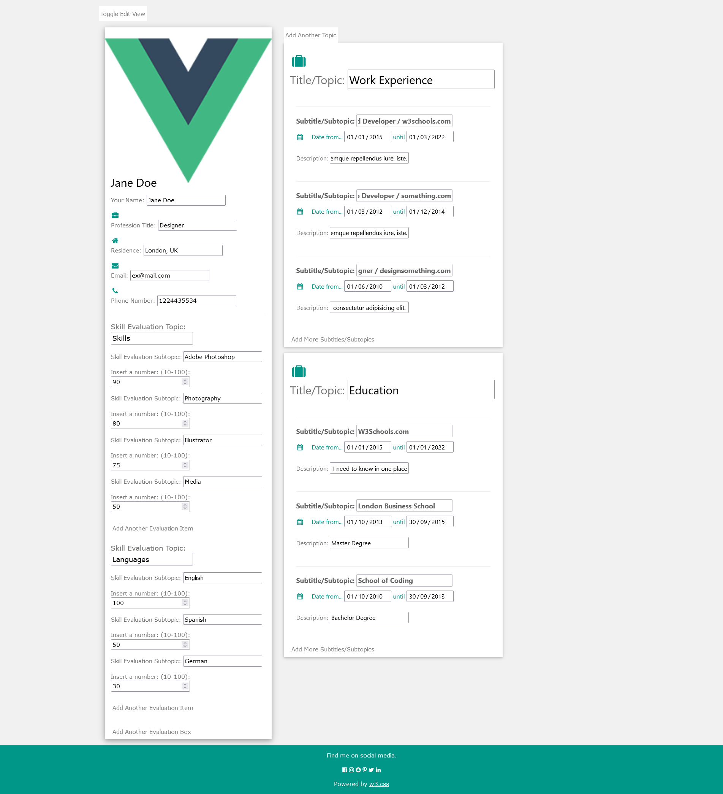
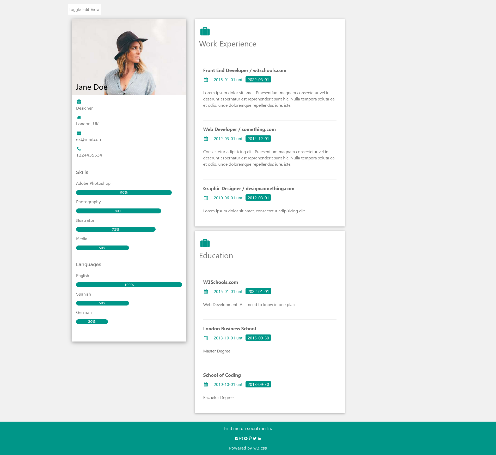
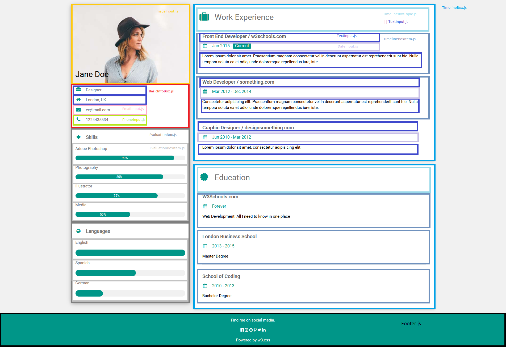
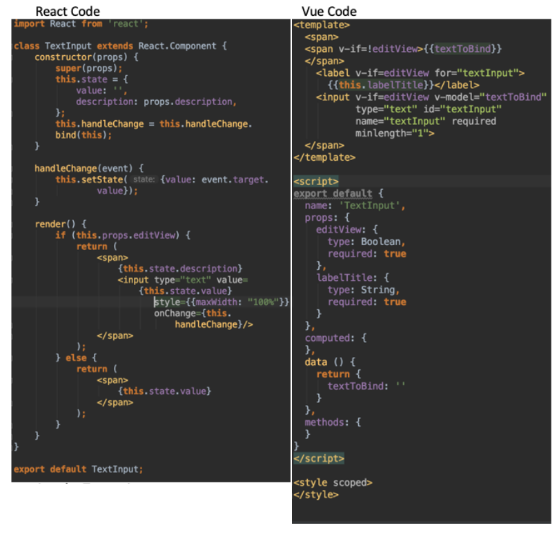

# Implementation of a portfolio-builder user interface written with the Vue.js JavaScript frontend framework
German: Implementierung einer Nutzeroberfläche mittels des Vue.js Javascript Frontend Frameworks am Beispiel einer Portfolio Webseite

React homepage: https://vuejs.org/

I have done the same app with the React JavaScript frontend framework at https://github.com/Kirshma/js-react-portfolio-app/#readme where I also have summarized my research about JavaScript frontend frameworks.

## Overview: What is this project?


This small app is a portfolio / cv / resume builder where you can:
1. fill out various types of fields with data about yourself e.g. your name, address, contact data, working experience, skills and more
2. dynamically add new fields and text-boxes if you want to do so, e.g. three boxes covering your working experience, five boxes describing skills
3. dynamically switch between an edit and a static/read-only/rendered type of view

Here's how it looks like when running the code with ``npm start`` (requires Node.js to be installed locally):

### The edit view



### The rendered view




### Understanding the classes

In order to make the classes more understandable for others I have visualized the component hierarchy which you can see below. The yellow box is the ImageInput component.





## My motivation behind this project
<br>I have written this application in order to learn one of the three most popular JavaScript frontend frameworks called "Vue.js" that is open-source and offers a model–view–viewmodel architectural approach.
<br>As the framework is based on JavaScript the main goal was to focus on this aspect only instead of building a HTML structure and CSS layout from scratch by myself.
<br>Therefore I came up with the idea of utilizing an open-source static HTML and CSS template and adding JavaScript elements to it.
One of the main strengths of JavaScript is that you are able to modify a static webpage and its Document Object Model (DOM) in order to add dynamic features to it, without having to reload it. Such an approach leads to a so called single-page application.

The template that I have chosen and used is provided by w3schools and can be found at the following URL: https://www.w3schools.com/w3css/tryw3css_templates_cv.htm.
<br>As you can see there, the template is a static page displaying information commonly found in a cv.
<br>Now if you would want to write something different about yourself or add more text boxes you would need to open up the HTML file and modify it.
<br>Though if you expect that the information is going to change often, which is definitely the case with the editing of your cv/portfolio during the creation process, it would be more comfortable to switch from a rendered to a dynamic edit view, add new boxes, fill out some fields and then switch back to the rendered view.
<br>This would be much more user-friendly and this is what I tried to achieve in this Vue.js learning project.

## Usage


Requires you to have Node.js installed on your machine in order to  run npm commands which can be downloaded at https://nodejs.org/en/.

Use the terminal to change directory to the program folder and type:
``npm install`` then, 
``npm start``

The standard output is at: http://localhost:8080/.

To stop the application go back to the terminal and press CTRL + C. The terminal should print: "Terminate batch job (Y/N)?" which you answer by typing: "y" in order to terminate the localhost service.


## Why Vue.js as a JavaScript frontend framework?

I have summarized my findings in regards to this question in my other project: https://github.com/Kirshma/js-react-portfolio-app#why-react-as-a-javascript-frontend-framework
<br> In short, Vue.js is not as popular and widespread as React but developers that have used this framework rate it positively and would use it again
while developers that have heard about Vue.js but have not used it yet say that they are interested in learning it.
<br>Therefore Vue.js is a good alternative to other frameworks like React should you not want to use those.

For those interested here is a side-by-side comparison of the basic textInput class code in both frameworks:



## Improvements
There is still a lot that can be done in order to improve this application.
My goal has majorly been to learn to use the framework and not to build a fully fledged application.
<br>Here are some things that could be done for improvement:
1. Number one thing is you can only add new boxes but not delete unwanted ones
2. Some inconsistencies with the date input where you have to put in the whole date, with the day, else the rendered view displays it incorrectly
3. Button descriptions and placements
4. Some UI elements are mispositioned and a bit "off"
5. Fancier buttons
6. I highly value writing tests but didn't do it for this project

## Build Setup

``` bash
# install dependencies
npm install

# serve with hot reload at localhost:8080
npm run dev

# build for production with minification
npm run build

# build for production and view the bundle analyzer report
npm run build --report

# run unit tests
npm run unit

# run e2e tests
npm run e2e

# run all tests
npm test
```

For a detailed explanation on how things work, check out the [guide](http://vuejs-templates.github.io/webpack/) and [docs for vue-loader](http://vuejs.github.io/vue-loader).
